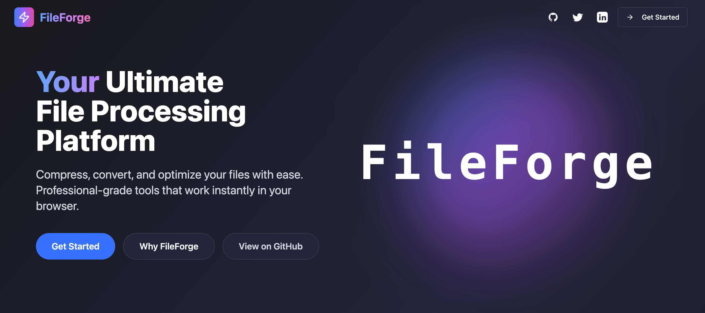

# FileForge

[](https://fileforgebyrahul.vercel.app/)

A modern, privacy-first web app for compressing, converting, and optimizing images and PDFs. Built for speed, quality, and a beautiful user experience.

---

## 🚀 Features

- **Compress Images**: Reduce image file size while maintaining quality
- **Compress PDF**: Make your PDF files smaller and easier to share
- **Image to PDF**: Convert JPG, PNG images to PDF format
- **PDF to Image**: Extract pages from PDF as high-quality images
- **Client-side Processing**: Your files never leave your device
- **Drag & Drop, Batch Support, and More!**

---

## 🌐 Live Demo

👉 [fileforgebyrahul.vercel.app](https://fileforgebyrahul.vercel.app/)

---


## 🖼️ Screenshots




---

## 🛠️ Tech Stack

- **Frontend**: React, TypeScript, Tailwind CSS
- **PDF/Image Processing**: pdf-lib, pdf.js, exif-js, pdfkit, FileSaver.js
- **UI Icons**: Lucide React
- **Deployment**: Vercel

---

## 🧑‍💻 Getting Started

1. **Clone the repo:**
   ```bash
   git clone https://github.com/rksingh-dev/FileForge.git
   cd FileForge
   ```
2. **Install dependencies:**
   ```bash
   npm install
   ```
3. **Run locally:**
   ```bash
   npm run dev
   ```
4. Open [http://localhost:5173](http://localhost:5173) in your browser.

---

## 🤝 Contributing

Pull requests are welcome! For major changes, please open an issue first to discuss what you would like to change.

---

## 📫 Contact

**Rahul Kumar Singh**  
[LinkedIn](https://www.linkedin.com/in/rahul-kumar-singh-1a14401ba/)  
Location: NIT RAIPUR, SIRPUR HOSTEL

---

## ⭐️ Star This Project

If you like FileForge, please consider starring the repo on [GitHub](https://github.com/rksingh-dev/FileForge)!
=======
# FileForge

[](https://fileforgebyrahul.vercel.app/)

A modern, privacy-first web app for compressing, converting, and optimizing images and PDFs. Built for speed, quality, and a beautiful user experience.

---

## 🚀 Features

- **Compress Images**: Reduce image file size while maintaining quality
- **Compress PDF**: Make your PDF files smaller and easier to share
- **Image to PDF**: Convert JPG, PNG images to PDF format
- **PDF to Image**: Extract pages from PDF as high-quality images
- **Client-side Processing**: Your files never leave your device
- **Drag & Drop, Batch Support, and More!**

---

## 🌐 Live Demo

👉 [fileforgebyrahul.vercel.app](https://fileforgebyrahul.vercel.app/)

---

## 🖼️ Screenshots

> _Add screenshots here!_

---

## 🛠️ Tech Stack

- **Frontend**: React, TypeScript, Tailwind CSS
- **PDF/Image Processing**: pdf-lib, pdf.js, exif-js, pdfkit, FileSaver.js
- **UI Icons**: Lucide React
- **Deployment**: Vercel

---

## 🧑‍💻 Getting Started

1. **Clone the repo:**
   ```bash
   git clone https://github.com/rksingh-dev/FileForge.git
   cd FileForge
   ```
2. **Install dependencies:**
   ```bash
   npm install
   ```
3. **Run locally:**
   ```bash
   npm run dev
   ```
4. Open [http://localhost:5173](http://localhost:5173) in your browser.

---

## 🤝 Contributing

Pull requests are welcome! For major changes, please open an issue first to discuss what you would like to change.

---

## 📫 Contact

**Rahul Kumar Singh**  
[LinkedIn](https://www.linkedin.com/in/rahul-kumar-singh-1a14401ba/)  
Location: NIT RAIPUR, SIRPUR HOSTEL

---

## ⭐️ Star This Project

If you like FileForge, please consider starring the repo on [GitHub](https://github.com/rksingh-dev/FileForge)!
>>>>>>> 549573a298ea662f390fce901918663adcdf2cfa
